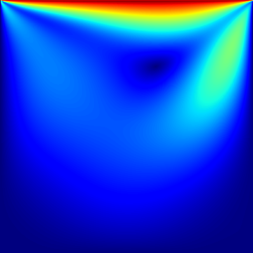
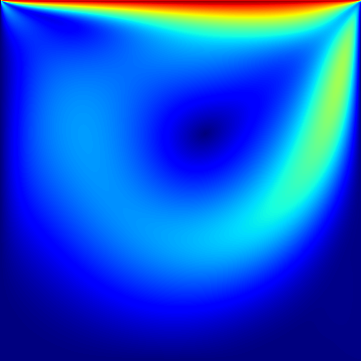
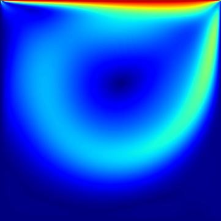

# MAC-taichi
A MAC (Marker-And-Cell) solver written in Taichi. More details of the MAC method could be found in its original
paper "Numerical Calculation of Time Dependent Viscous Incompressible Flow of Fluid with Free Surface" by Francis H. Harlow and J. Eddie Welch. 

## Requirements
- Taichi
- Matplotlib

You can install the requirements either by the following command
```bash
python3 -m pip install taichi matplotlib
```
or by using the `requirements.txt` file
```
python3 -m pip install -r requirements.txt
```

## The lid-driven cavity case
Lid-driven cavity is a common validation case used by CFD solvers.

## How to run
Simply run the `mac.py` script through Python
```bash
python3 mac.py
```
and you should see the following GUI animation

<p style="text-align:center;"></p>

## Results
Below are the contour plots of the velocity magnitude for Re = 100, Re = 400 and Re = 1000 at steady state, respectively.
|Re = 100|Re = 400|Re = 1000|
|:---:|:---:|:---:|
||||